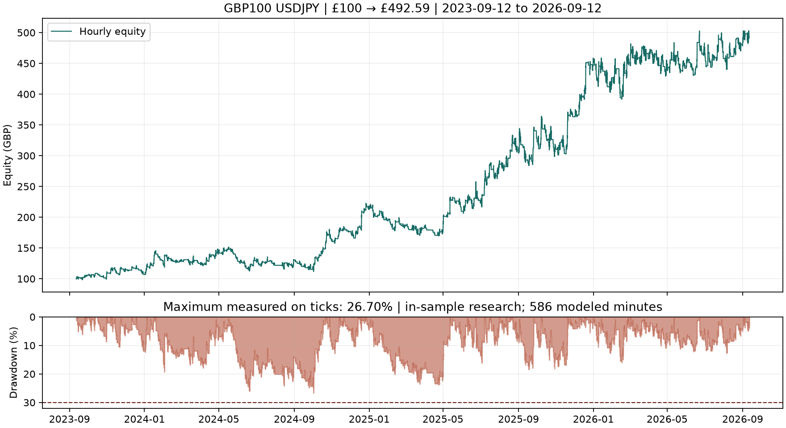

# Codex £100 challenge

The strongest completed baseline found grew **£100 to £492.59** over 12 September 2023 through 11 September 2026, with **26.70% maximum equity drawdown**. This is a conditional historical research result: 586 minutes on one missing-data day use modeled tick paths, and the whole three-year period was used for optimisation. It is not a demonstrated global maximum or an out-of-sample result.

| Metric | Verified baseline |
|---|---:|
| Starting capital | £100 GBP |
| Closing balance and equity | £492.59 |
| Net profit / total return | £392.59 / 392.59% |
| Compound annual growth (three-year convention) | 70.15% |
| Maximum equity drawdown, measured on ticks | 26.7025% |
| Net profit factor | 1.2032 |
| Closed trades | 853 |
| Conversion charges deducted from cash | £34.00 |
| Position sizes | 0.01–0.09 lot |
| Overnight positions | 0 |
| Market / execution delay | USDJPY / 100 ms |

The final evidence is [final_verified](evidence/final_verified/), including the [native report](evidence/final_verified/final_verified.htm), [acceptance checks](evidence/final_verified/acceptance.json), source/binary snapshots, explicit tester inputs, cash ledger and tick-based drawdown statistics. Native report profit and drawdown treat fee withdrawals differently: use the reconciled net values above, not the native gross profit or its understated 11.57% drawdown.

**Cost sensitivity:** adding half a pip to every spread reduced final equity to **£100.69**, with 28.74% drawdown. The baseline is not robust to this modest increase in trading costs. See the [stress report](evidence/stress_final/stress_final.htm).

**Earlier-period failure:** the frozen EA lost **22.97%** in a continuous **2019–2021** test, closing at **£77.03** with **28.76% drawdown**. All 128 trades occurred in 2019; no further trades were taken after 27 June 2019. The same capital and equity peak carried through 2020–2021. See [the full negative result](docs/RESULTS-2019-2021.md).

**Continuous 2020–current result:** the same frozen EA closed at **£114.35** after the completed 11 September 2026 session, a 14.35% total return with 28.87% drawdown. It made no trades after February 2022, and two Christmas positions carried over weekend closures. The numeric targets pass, but the strict daily-flat acceptance check fails. See [the full result](docs/RESULTS-2020-CURRENT.md).

**£500 continuous 2019–current rerun:** with the same frozen EA and only the tester deposit changed to £500, the account closed at **£384.43** (−23.11%) with **28.95%** tick-observed drawdown. All 122 trades occurred in 2019; all execution, data, and margin checks passed, while the net-profit acceptance check failed. See [the full result](docs/RESULTS-2019-2026-GBP500.md).

## Strategy

**Subsequent untouched-year test:** the same frozen EA grew £100 to **£432.29 in calendar 2022**, with **25.16% equity drawdown**, 297 trades and 1.4874 net profit factor. All accounting and independent margin checks passed. One missing tick day uses 1,440 modeled minutes. See [the full 2022 results](docs/RESULTS-2022.md).

The EA buys USDJPY when the last completed H1 close exceeds the close eight bars earlier by more than one 14-bar average true range. Entries occur at the first tick of an eligible hour, from 01:00 through 18:59 in stored quote time. There is one position at a time; stops are 1.25 ATR, targets 12 ATR, and positions close from 20:00. No current-bar future prices enter the signal.

Nominal risk is 2% of equity, further reduced by available drawdown headroom. The EA rounds volume down to IG's 0.01-lot grid and skips unaffordable trades. It caps buffered margin at 60% of equity/free margin and halts at a 29% measured drawdown threshold. These controls do not guarantee the ceiling under future gaps or different execution.

IG-DEMO reports nominal leverage 1:200, but measured USDJPY margin is approximately 3.52% of notional. The custom research symbol uses **3.53%**, approximately 1:28.33 effective leverage, with an additional 15% sizing buffer and £2,602-per-lot margin floor. The final tester journal confirms minimum/step 0.01, 100,000 contract size, margin call 99% and stop-out 50%. Historical broker margin changes are not independently available; the observed rate is applied throughout.

## Data and costs

The frozen dataset preserves 70,421,527 IG quotes including warm-up, plus 113,465 Dukascopy quotes for part of 14 January 2025. The remaining **586 minutes** that day use observed IG M1 bars with generated intraminute paths. Every imported quote and gap minute bar was read back and checked. The main-symbol journal has no discarded quotes after reconstruction. This is explicitly not an entirely recorded-tick backtest.

IG bid/ask spreads are retained. The substitute quotes have one pip added to asks, and the fallback bars have at least one pip spread. Each realised gain or loss incurs a conservative 0.8% conversion charge, rounded to pennies and removed from available cash before subsequent sizing. No additional deposits are allowed. Separate fill and GBP conversion audits accompany the result.

## Deliverables and reproduction

- [EA source](src/Challenge.mq5), [compiled EA](src/Challenge.ex5), [frozen settings](config/final.json) and [MT5 set file](config/final.set).
- [Reproduction instructions](docs/REPRODUCE.md), [methodology and limitations](docs/METHODOLOGY.md), and [search results](docs/RESULTS.md).
- [Raw-data hashes](evidence/USDJPY-raw-manifest.json), [gap provenance](evidence/gap-provenance.json), and [data integrity checks](evidence/data-integrity.json).

The large raw dataset remains under `data/` on this VM and is excluded from Git. Preserve it with this repository for exact replay; a source-only clone requires restoration or reacquisition of those inputs. The EA accepts Strategy Tester and demo accounts only; it refuses to initialize on live accounts. No demo or live deployment has been validated. This repository began empty, with no base commit; publication has not been requested.
