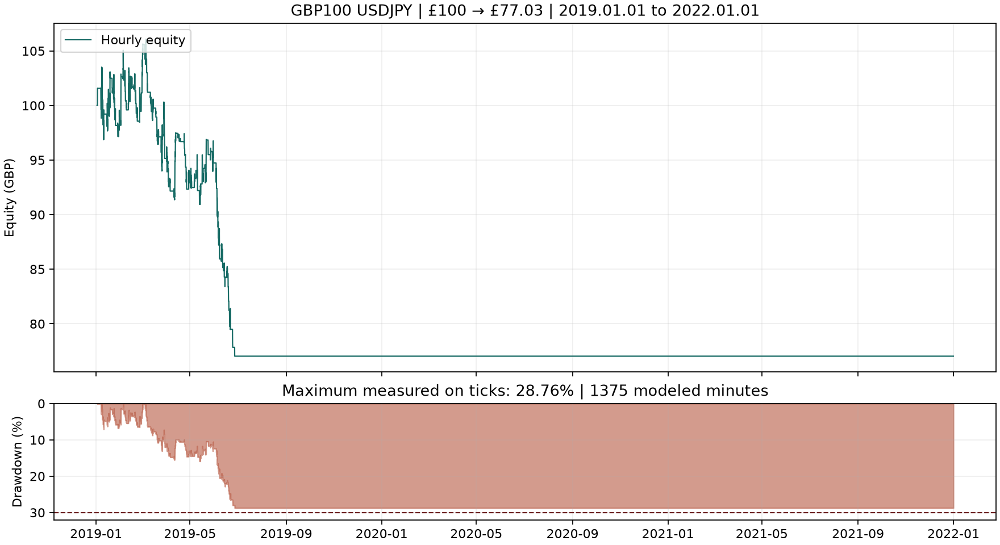

# Continuous 2019–2021 result: growth failed

The frozen strategy finished at **£77.03 from £100**, a **22.97% loss**, with **28.7617% maximum equity drawdown**. It stayed within the 30% ceiling but failed the growth objective. No optimisation, parameter changes or annual capital resets were performed.

| Metric | Result |
|---|---:|
| Continuous test interval | 2019.01.01 inclusive–2022.01.01 exclusive |
| Starting capital | £100 GBP |
| Final net balance/equity | £77.03 |
| Net profit / total return | −£22.97 / −22.97% |
| Compound annual growth | −8.3315% |
| Maximum tick-observed equity drawdown | 28.7617% |
| Net profit factor | 0.7200 |
| Closed trades | 128 |
| Conversion fees deducted from cash | £1.21 |
| Volume range | 0.01–0.02 lot |
| Overnight positions | 0 |
| Independent reference final cash | £77.02068 |

## Annual contributions to the same account

| Year | Opening GBP | Closing GBP | Return | Trades |
|---|---:|---:|---:|---:|
| 2019 | 100.00 | 77.03 | −22.97% | 128 |
| 2020 | 77.03 | 77.03 | 0.00% | 0 |
| 2021 | 77.03 | 77.03 | 0.00% | 0 |

These are portions of one continuous test, not three separate £100 tests. The last position closed on **27 June 2019 at 02:54:56**. The tester continued through December 2021, with hourly equity records confirming the flat £77.03 balance. Consequently the flat later years do not demonstrate profitable trading in those years.

The recorded equity peak was £108.13. At the final £77.03 balance, the unchanged sizing rule limited per-trade risk to:

`min(77.03 × 2%, 0.8 × (77.03 − 108.13 × 71%)) = £0.20616`.

This extremely small risk allowance, together with the 0.01-lot minimum, is consistent with the subsequent inactivity. The EA does not log every skipped signal, so a specific rejection reason for every later opportunity is not independently established. The 29% hard halt threshold itself was not reached by the recorded tick drawdown. The equity peak and risk state were never reset to resume trading.

## Frozen setup and verification

The source, compiled EA and settings match commit `80296254c8105ac59b8b6bc4f140d7a49669c37e`, identical to those used for the earlier 2022 test. The period was selected in [the protocol](PROTOCOL-2019-2021.md) before price acquisition. All report inputs and the actual report dates were checked.

The test uses Model 4, 100 ms execution delay, USDJPY H1, £100 GBP, the original 2% nominal risk and all existing entry, exit, fee and margin rules. The custom symbol retains 3.53% notional margin (approximately 1:28.33 effective leverage) despite nominal tester account leverage 1:200. Historical changes in IG margin rates remain approximated by the frozen observed rate.

**29 of 30 acceptance checks pass. The failed check is `net_profit_positive`.** Source/binary identity, full period, fees, lot grid, capital, margin, risk sizing and the 30% drawdown condition pass. This failure is retained in `acceptance.json`; the accounting checks have not been relaxed to label the strategy successful.

The native report's gross trading P/L is −£21.76; deducting £1.21 of cash conversion fees gives −£22.97 net. The native withdrawal-adjusted drawdown is 4.25%, which understates the challenge's equity decline. The relevant measure is the separately tracked **28.76%**.

## Data and independent audits

- **70,357,130 recorded IG quotes including warm-up**, starting 20 December 2018. All imported quotes and minute OHLC were read back and matched.
- The sole non-holiday empty weekday was **1 October 2021**. Four six-hour retries returned no ticks. Its **1,375 observed IG M1 bars** use generated intraminute paths with at least a one-pip spread. The journal confirms exactly that fallback day and no discarded trading-symbol quotes. Empty Christmas and New Year holidays are listed separately in the data manifest.
- All **256 fills** matched recorded quotes within the documented timestamp tolerance. No fills used the modeled day, which occurred after the account's last trade.
- The native GBPJPY conversion history generated fallback/discard warnings. Independent recorded GBPJPY quotes were available for all **128 trades**, with maximum quote age 1.493 seconds and maximum individual valuation difference £0.00503.
- Revaluing the same executed trades and costs produces **£77.02068**, £0.00932 below native net cash. Every entry was margin-feasible; maximum independently valued margin/cash was **52.0661%**. No M1 conversion bounds were needed. This is a fixed-fill valuation audit, not a separate strategy resimulation.

The unfavorable result is supported by recorded execution quotes and independently reconciled cash. It is material evidence against treating the profitable development period and 2022 result as proof of reliable performance across market periods. The strategy remains frozen and the negative result is preserved.

## Evidence and reproduction

- [Native report](../evidence/holdout_2019_2021/holdout_2019_2021.htm)
- [Acceptance checks](../evidence/holdout_2019_2021/acceptance.json)
- [Annual account contributions](../evidence/holdout_2019_2021/annual-results.json)
- [Independent capital audit](../evidence/holdout_2019_2021/reference-capital-validation.json)
- [Data integrity](../evidence/holdout2019_2021-data-integrity.json)
- [Reproduction setup](REPRODUCE-2019-2021.md)

After running a fresh named test, use:

```powershell
python tools/verify.py evidence/holdout_2019_2021_repeat --start 2019.01.01 --end 2022.01.01 --fallback-minutes 1375 --fallback-day 2021.10.01
# A nonzero verification exit is expected for the negative profit result.
python tools/audit_fills.py evidence/holdout_2019_2021_repeat
python tools/audit_fx.py evidence/holdout_2019_2021_repeat
python tools/audit_margin_reference.py evidence/holdout_2019_2021_repeat
python tools/annual_results.py evidence/holdout_2019_2021_repeat
python tools/plot_result.py evidence/holdout_2019_2021_repeat --modeled-minutes 1375
```


