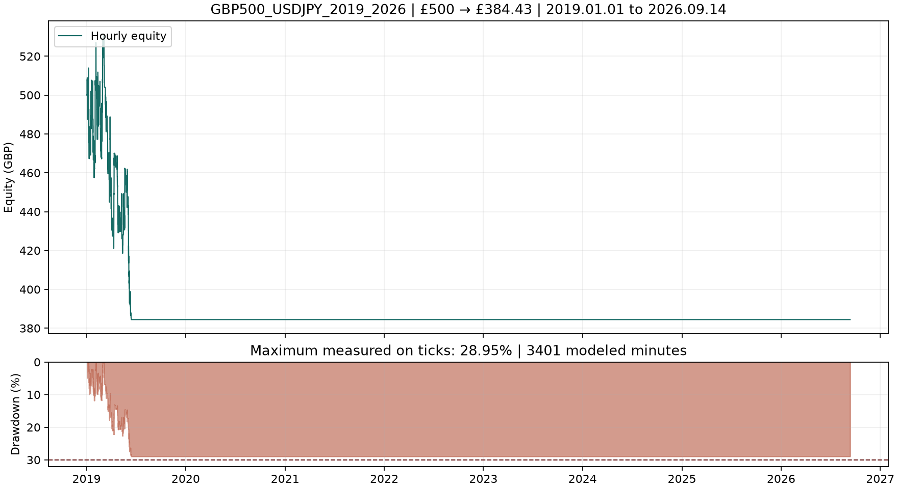

# Continuous 2019–current £500 result

The frozen strategy decreased a single **£500.00** account to **£384.43** from 1 January 2019 through 14 September 2026, a **£115.57 loss (−23.11%)**. The end date includes the completed Friday 11 September 2026 session and the empty weekend calendar days; it does not include intraday Monday data.

| Metric | Result |
|---|---:|
| Starting capital | £500.00 GBP |
| Final net balance/equity | £384.43 |
| Net profit / total return | −£115.57 / −23.114% |
| Compound annual growth | −3.3554% |
| Maximum tick-observed equity drawdown | 28.9540% |
| Net profit factor | 0.7973 |
| Closed trades | 122 |
| Conversion fees deducted from cash | £8.20 |
| Position sizes | 0.01–0.10 lot |
| Overnight positions | 0 |
| Independent reference final cash | £384.41420 |

The numerical drawdown limit, execution-accounting controls, same-day-flat check, and all data checks pass. The acceptance result is **not a full pass** because `net_profit_positive` is false. No settings were changed after the pre-run protocol was written.

## Continuous-account contributions

The account was funded once and never reset. All 122 closed trades occurred in 2019; the frozen EA then made no further trades during 2020–2026. The source does not log every skipped signal, so this establishes the absence of later exposure rather than a single cause.

| Year | Opening GBP | Closing GBP | Net return | Trades |
|---|---:|---:|---:|---:|
| 2019 | 500.00 | 384.43 | −23.11% | 122 |
| 2020 | 384.43 | 384.43 | 0.00% | 0 |
| 2021 | 384.43 | 384.43 | 0.00% | 0 |
| 2022 | 384.43 | 384.43 | 0.00% | 0 |
| 2023 | 384.43 | 384.43 | 0.00% | 0 |
| 2024 | 384.43 | 384.43 | 0.00% | 0 |
| 2025 | 384.43 | 384.43 | 0.00% | 0 |
| 2026 through 11 September | 384.43 | 384.43 | 0.00% | 0 |

## Frozen setup and data

The [protocol](PROTOCOL-2019-2026-GBP500.md) freezes the Expert Advisor source, binary and inputs at `85847255bd2b3ec384db90f4b210ebc326e50499`. The only tester change from the earlier £100 continuous test is `Deposit=500`. The native report confirms £500 GBP, Model 4, 100 ms delay, the requested full interval, and the frozen binary. No optimisation, annual capital reset, retuning, or strategy change occurred.

The linked replay contains **207,579,682 recorded quote records**, including warm-up. Every imported quote and minute bar was read back and verified. The journal reports only the declared trading-symbol missing-tick windows and no discarded trading-symbol quotes:

| Day | Modeled minutes | Source |
|---|---:|---|
| 1 October 2021 | 1,375 | IG observed M1 bars |
| 1 March 2022 | 1,440 | IG observed M1 bars |
| 14 January 2025 | 586 | IG observed M1 bars; remaining quotes from the preserved independent-provider patch |

The total is **3,401 modeled intraminute paths**. MT5 also reported generated or mismatched ticks for the GBPJPY conversion series; those messages are separate from the USDJPY execution data and are addressed by the independent conversion audit.

## Execution, conversion, and margin evidence

All **244** entry and exit fills matched a recorded USDJPY quote within the report’s two-seconds-before to three-seconds-after tolerance. The independent GBPJPY conversion audit matched all 122 trades to recorded quotes, with a total native-versus-reference difference of **£0.01580** and no missing conversion quote.

The independent fixed-fill capital ledger finds every entry margin-feasible under the observed 3.53% notional margin rate. The largest reference margin fraction is **52.0235%**, minimum reference cash is **£384.41420**, and no adverse M1 conversion bound was required. This is a fixed-fill accounting audit, not a second strategy simulation.

## Evidence

- [Native report](../evidence/holdout_2019_2026_gbp500/holdout_2019_2026_gbp500.htm)
- [Acceptance checks](../evidence/holdout_2019_2026_gbp500/acceptance.json)
- [Annual continuous-account contributions](../evidence/holdout_2019_2026_gbp500/annual-results.json)
- [Fill audit](../evidence/holdout_2019_2026_gbp500/fill-audit.json)
- [Independent capital ledger](../evidence/holdout_2019_2026_gbp500/reference-capital-validation.json)
- [Replay-data integrity](../evidence/USDJPY2019_2026_GBP500-data-integrity.json)

