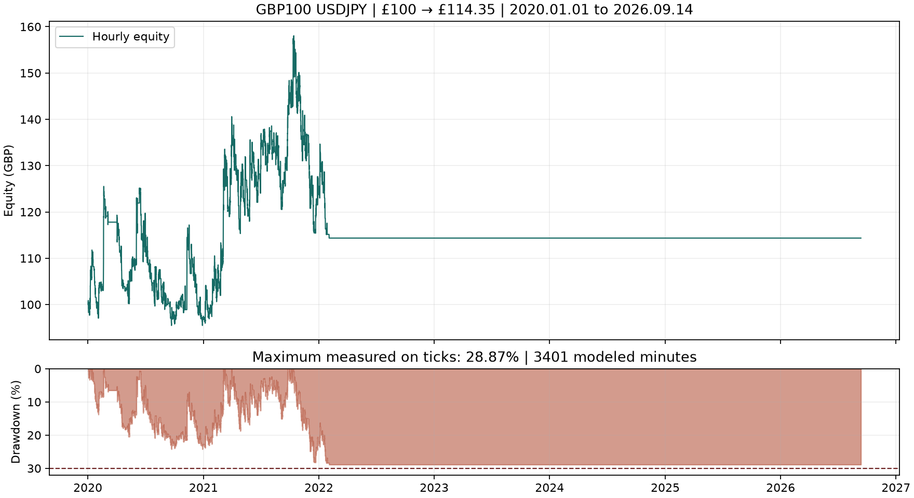

# Continuous January 2020 to current date result

The frozen strategy increased £100 to **£114.35** across 1 January 2020 through 14 September 2026. The closing date includes the latest completed FX session, Friday 11 September 2026; Saturday and Sunday were included as empty calendar days, and no incomplete Monday session was used.

| Metric | Result |
|---|---:|
| Starting capital | £100.00 GBP |
| Final net balance/equity | £114.35 |
| Net profit / total return | £14.35 / 14.35% |
| Compound annual growth | 2.0211% |
| Maximum tick-observed equity drawdown | 28.8735% |
| Net profit factor | 1.0280 |
| Closed trades | 570 |
| Conversion fees deducted from cash | £8.42 |
| Position sizes | 0.01–0.03 lot |
| Independent reference final cash | £114.27233 |

The numerical return and drawdown requirements pass. The overall acceptance result is **not a full pass**: two positions remained open past their calendar day. This violates the frozen EA's intended daily-close rule, even though neither position exceeded the drawdown ceiling.

## Continuous account contributions

The account was funded once and never reset. The equity peak and drawdown headroom carried across every boundary.

| Year | Opening GBP | Closing GBP | Net return | Trades |
|---|---:|---:|---:|---:|
| 2020 | 100.00 | 97.22 | −2.78% | 256 |
| 2021 | 97.22 | 124.42 | 27.98% | 296 |
| 2022 | 124.42 | 114.35 | −8.09% | 18 |
| 2023 | 114.35 | 114.35 | 0.00% | 0 |
| 2024 | 114.35 | 114.35 | 0.00% | 0 |
| 2025 | 114.35 | 114.35 | 0.00% | 0 |
| 2026 through 11 September | 114.35 | 114.35 | 0.00% | 0 |

The last closed position was on 2 February 2022. The EA did not take another trade afterward. Its source does not log every skipped signal, so this evidence does not establish a single cause; it does establish that the frozen continuous-account result had no exposure during 2023–2026.

## Frozen setup

The pre-run [protocol](PROTOCOL-2020-CURRENT.md) froze the source, binary and inputs at `07d51bca04a22e6fe36313d19c3972f078bc3a72`. The report confirms every effective input, £100 GBP, Model 4, 100 ms delay, the full interval and the same binary snapshot. There was no optimisation, annual capital reset or retuning.

The tester reports 1:200 account leverage, 99% margin call and 50% stop-out. The custom USDJPY symbol nevertheless applies the existing 3.53% notional margin approximation, around 1:28.33 effective leverage, with a 15% sizing buffer and £2,602-per-lot floor. The original observed margin rate is applied historically; actual historical IG margin changes are not available.

## Acceptance failure: Christmas carryovers

All acceptance checks pass except `no_overnight`. These two trades opened before the market's early Christmas shutdown, so there was no 20:00 quote for the EA's daily flattening rule:

| Open | Close | Closing reason |
|---|---|---|
| 24 December 2020 11:00 | 27 December 2020 23:03:12 | Stop loss |
| 24 December 2021 14:00 | 26 December 2021 23:04:11 | Stop loss |

The 29% hard halt did not trigger. Correcting this behavior would alter the strategy's exit behavior and was outside the request to test the frozen configuration, so it was not changed. The result should not be represented as satisfying a strict same-day-flat requirement.

## Data and audit evidence

The linked replay contains **183,966,913 quote records**, including warm-up. Every imported quote and minute bar was read back and verified. The data combines the prior preserved datasets with a new January–August 2023 IG segment; manifests and source hashes are in `USDJPY2020_current-manifest.json`.

Three known tick gaps remain explicit rather than hidden by MT5's report label:

| Day | Modeled minutes | Source |
|---|---:|---|
| 1 October 2021 | 1,375 | IG observed M1 bars |
| 1 March 2022 | 1,440 | IG observed M1 bars |
| 14 January 2025 | 586 | IG observed M1 bars; remaining day quotes from the preserved independent-provider patch |

The total is **3,401 modeled intraminute paths**. The tester journal records exactly those missing-tick summaries and no discarded trading-symbol quotes. It also reports numerous generated/mismatched ticks for GBPJPY conversion history; the trading-symbol result should not be confused with a fully recorded-tick result.

All **1,140** execution fills matched preserved quotes within the report's second-resolution tolerance. The independent GBPJPY audit matched 569 of 570 trade conversions to recorded quotes. The remaining conversion, at 27 December 2020 23:03:12, had no quote at or before its second; an adverse bound from the first available IG M1 bar at 23:04 was used in the capital ledger. The ledger closes at £114.27233, 7.8p below native net cash. Every entry is margin-feasible; peak independent margin/cash is 52.1141%, and minimum reference cash is £95.50.

This is a fixed-fill audit, not a second strategy simulation. The numerical result is weak after 6.7 years, and the strategy's 2023–2026 inactivity and holiday carryovers are material limitations.

## Evidence

- [Native report](../evidence/holdout_2020_current/holdout_2020_current.htm)
- [Acceptance checks](../evidence/holdout_2020_current/acceptance.json)
- [Annual continuous-account contributions](../evidence/holdout_2020_current/annual-results.json)
- [Independent capital ledger](../evidence/holdout_2020_current/reference-capital-validation.json)
- [Fill audit](../evidence/holdout_2020_current/fill-audit.json)
- [Replay-data integrity](../evidence/USDJPY2020_current-data-integrity.json)

