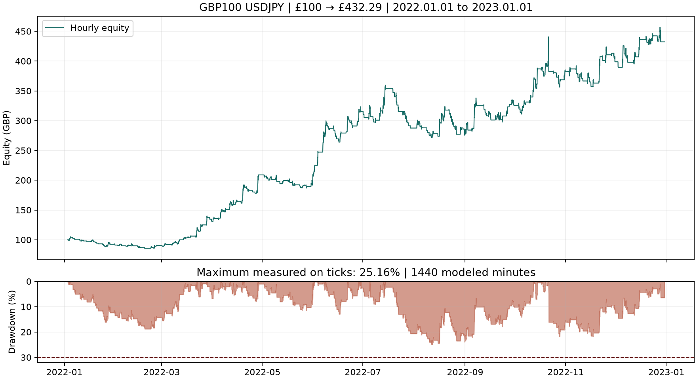

# Previously untested 2022: frozen-strategy result

**£100 grew to £432.29, with 25.1581% maximum equity drawdown.** The strategy passed the numerical growth and drawdown conditions in this previously untested calendar year. No strategy inputs or source code were changed, and no optimisation was performed on the year.

| Metric | Result |
|---|---:|
| Test period | 1 January–31 December 2022 |
| Tester interval | 2022.01.01 inclusive–2023.01.01 exclusive |
| Starting capital | £100 GBP |
| Final net balance/equity | £432.29 |
| Net profit | £332.29 |
| Total return / one-year compound growth | 332.29% |
| Maximum tick-observed equity drawdown | 25.1581% |
| Net profit factor | 1.4874 |
| Closed trades | 297 |
| Conversion fees deducted from cash | £13.65 |
| Trade sizes | 0.01–0.06 lot |
| Overnight holdings | 0 |
| Independent reference final cash | £432.26445 |

## Frozen setup and scope

The base commit is `b29d9586c58929c358b9741dd957e10175d0a767`. The strategy source and EX5 hashes exactly match the earlier `final_verified` baseline, and all report inputs match the frozen configuration. This year predates every previous native test and the screening history in this repository, which began in September 2023. The selection was recorded in [the protocol](UNTESTED-YEAR-PROTOCOL.md) before obtaining the new year's prices.

The test retains £100 GBP starting capital, USDJPY long momentum on H1, 2% nominal risk, 1.25 ATR stop, 12 ATR target, the same trading hours and drawdown controls, and 100 ms execution delay. Minimum/step volume is 0.01 lot. The tester reports 1:200 account leverage, but the research symbol uses 3.53% notional margin (approximately 1:28.33), plus the existing sizing buffer and cash margin floor. Margin call is 99% and stop-out 50%. Historical IG margin-rate changes remain an approximation using the frozen observed rate.

## Validation and data limitations

All 30 acceptance checks pass, including effective inputs, actual report period, source/binary hashes, lot grid, fees, available capital, margin sizing and equity drawdown. The native trading-profit statistics and journal final-balance line exclude the £13.65 cash fee deductions; net cash is reconciled against the report's deal ledger. Native withdrawal-adjusted drawdown is 14.48%, so the relevant challenge measure is the larger independently tracked **25.16%**.

The dataset contains **41,155,534 recorded IG quotes including warm-up** from 20 December 2021. Every imported quote and minute OHLC was read back. The only missing recorded-tick day was **1 March 2022**. IG returned zero ticks after four separate six-hour retries, so its **1,440 observed M1 bars** were used with generated intraminute paths and at least a one-pip spread. The native journal confirms exactly this one-day fallback and no discarded trading-symbol quotes. Consequently this is not an entirely recorded-tick result.

All **594 fills** passed the independent price checks: 592 matched recorded quotes within the documented second-resolution tolerance; two were within the declared M1 fallback bounds. The latter are weaker evidence than exact recorded fills.

Recorded GBPJPY quotes were available for all 297 trades in the independent currency audit. Revaluing the same executed fills and conversion fees gives **£432.26445**, £0.02555 below native net cash. Every entry remained margin-feasible; maximum reference margin/cash was **52.0004%**. There were no M1 conversion bounds required. This is an independent valuation and capital-feasibility check, not a second strategy simulation.

## Interpretation

The frozen strategy succeeded on this previously untouched historical year, which provides useful evidence beyond the development window. One successful year does not remove the baseline's demonstrated spread sensitivity, the declared price-path approximation, or the need for prospective validation. No retuning followed this result, and no additional spread stress was run on 2022.

- [Native report](../evidence/holdout_2022/holdout_2022.htm)
- [Acceptance checks](../evidence/holdout_2022/acceptance.json)
- [Independent capital audit](../evidence/holdout_2022/reference-capital-validation.json)
- [Fill checks](../evidence/holdout_2022/fill-audit.json)
- [Reproduction instructions](REPRODUCE-2022.md)

